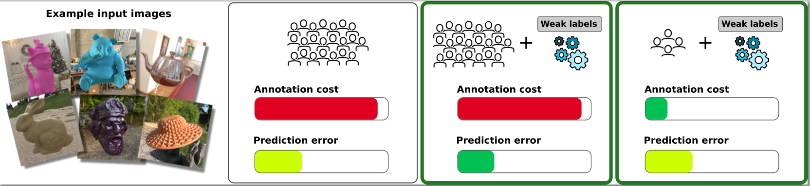

# Predicting Perceived Gloss: Do Weak Labels Suffice?

### [](https://graphics.unizar.es/projects/perceived_gloss_2024/) | [](https://arxiv.org/pdf/2403.17672.pdf) | [](https://nas-graphics.unizar.es/s/M6CD8PY4DsrNFmm)

The official **Tensorflow**  implementation of [**Predicting Perceived Gloss: Do Weak Labels Suffice?**](https://graphics.unizar.es/projects/perceived_gloss_2024/). 

[Julia Guerrero-Viu](http://webdiis.unizar.es/~juliagv/)<sup>1*</sup>
[J. Daniel Subias](https://dsubias.github.io/#about)<sup>1*</sup>
[Ana Serrano](https://ana-serrano.github.io/)<sup>1</sup>
[Katherine R. Storrs](https://www.katestorrs.com/#about)<sup>2</sup>
[Roland W. Fleming](https://www.allpsych.uni-giessen.de/fleminglab/)<sup>3,4</sup>
[Belen Masia](http://webdiis.unizar.es/~bmasia/)<sup>1</sup>
[Diego Gutierrez](http://giga.cps.unizar.es/~diegog/)<sup>1</sup>

<sup>1</sup>Universidad de Zaragoza, I3A, Spain, 

<sup>2</sup>University of Auckland, New Zealand, 

<sup>3</sup>Justus Liebig University Giessen, Germany, 

<sup>4</sup>Center for Mind, Brain and Behavior, Universities of Marburg and Giessen, Germany

<sup>*</sup>Joint first authors


In **Eurographics 2024** (Oral Presentation)



## TL;DR Quickstart
```
# Clone repository and enter in the folder
git clone git@github.com:juliagviu/perceived_gloss_wsl.git

# Download data and pretrained models (see below)

# Create a python environment
python -m venv inference_env
source inference_env/bin/activate
pip install -r requirements.txt

# Run the gloss predictor in inference (e.g., using our weakly-supervised model trained with S.100%+BSDF)
cd gloss_predictor
python inference.py s_100_bsdf
```

## Download Dataset and Models
You can download our test dataset from [here](https://nas-graphics.unizar.es/s/M6CD8PY4DsrNFmm).

Also, you can download additional datasets to test our model, such as the test set B from [Serrano et al. 2021](https://mig.mpi-inf.mpg.de/) that we use to evaluate generalization.


Our pretrained models are available [here](https://nas-graphics.unizar.es/s/trbfGHdrKRig6D2)

## Organization of the Code
* `gloss_predictor`: code used to train and evaluate the gloss predictor models from the paper

* `weak_labels_code`: code used to compute the weak labels used in the paper in the script `get_weak_labels.py`, you can download the images used to compute the iamge statistics here, and compute the skewness with the script `compute_statistics.py`.

* `xmls`: xmls files used to render our analytical synthetic dataset.

* `geometries`: files of the geometries in our synthetic dataset.

* `data`: folder to place the datasets.

* `models`: folder to place the pretrained models.
 

## Rendering dataset

To render your own synthetic dataset, you can use the script `render.py`, installing the rquirements using the file `requirements_rendering.txt`:

```
pip install -r requirements_rendering.txt
```

Then you can run: 

```
python render.py -o OUTPUTNAME
```

If everything works without errors, the images are saved in `OUTPUTNAME_renders_fixed_color`. You will also get a `OUTPUTNAME_analytic_materials_fixed_color.csv` with the logg of the parametres used during rendering for each image. You can use the scrip `exr2png.py` to get the inmages in Low Dynamic Range (LDR): 

```
python exr2png.py -i OUTPUTNAME_renders_fixed_color/*.exr -l True -o ldr_images
```


## Cite

If you use this work, please consider citing our paper with the following Bibtex code:

```
@article {guerrero2024gloss,
      journal = {Computer Graphics Forum}, 
      title = {{Predicting Perceived Gloss: Do Weak Labels Suffice?}},
      author = {Guerrero-Viu, Julia and Subias, J. Daniel and Serrano, Ana and Storrs, Katherine R. 
                and Fleming, Roland W. and Masia, Belen and Gutierrez, Diego}, 
      year = {2024},
      publisher = {The Eurographics Association and John Wiley & Sons Ltd.}, 
      ISSN = {1467-8659}, 
      DOI = {10.1111/cgf.15037}
}
```

## Acknowledgements

This code refers to the following two projects:

[1] [Mitsuba 3](https://www.mitsuba-renderer.org/)

[2] [Project Page of [Serrano et al. 21]](https://mig.mpi-inf.mpg.de/) 

This work has received funding from the Spanish Agencia Estatal de Investigación (Project PID2022-141539NB-I00 funded by MCIN/AEI/10.13039/501100011033/FEDER, EU) and from the European Union’s Horizon 2020 research and innovation programme under the Marie Skłodowska-Curie grant agreement No. 956585 (PRIME). This research was also supported by the Deutsche Forschungsgemeinschaft (DFG, German Research Foundation—project number 222641018—SFB/TRR 135TP C1), by the European Research Council (ERC, Advanced Grant “STUFF”—project number ERC-2022-AdG-101098225), by the Marsden Fund of the Royal Society of New Zealand (MFPUOA2109) and by the Cluster Project “The Adaptive Mind”, funded by the Excellence Program of the Hessian Ministry of Higher Education, Science, Research and Art. 
Julia Guerrero-Viu was supported by the FPU20/02340 predoctoral grant and J. Daniel Subias was supported by the CUS/702/2022 predoctoral grant.


## Contact

    juliagviu@unizar.es (Julia Guerrero Viu)
    dsubias@unizar.es (José Daniel Subías)

### Disclaimer:
The code from this repository is from a research project, under active development. Please use it with caution and contact us if you encounter any issue.

## License

This software is under GNU General Public License Version 3 (GPLv3), please see GNU License
For commercial purposes, please contact the authors.